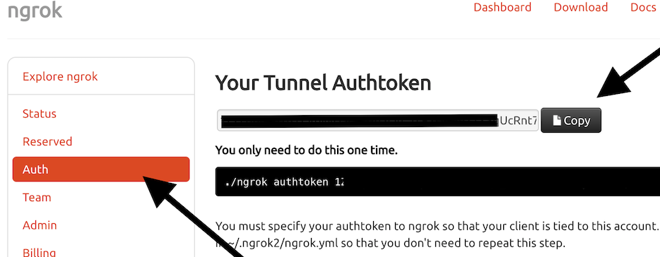

## Bucko

Provides some friendly assistance to get started developing apps on the Tradeshift platform.

## Setup

1. Install dependencies.

    ```bash
    $ npm install
    ```
2. Get the [ngrok](https://ngrok.com/) account and figure out the auth token in settings as bucko application relies on ngrok tunnel provider. (It's free)



3. Activate the [Bucko](https://sandbox.tradeshift.com/#/apps/Tradeshift.AppStore/apps/Tradeshift.Bucko) app on Tradeshift to get API credentials.

4. Run the command shown in the Bucko app to setup environment variables.

    ```bash
    $ cat > .env << EOF
    # API credentials for Bucko on Tradeshift
    # https://sandbox.tradeshift.com/#/apps/Tradeshift.Bucko
    TS_API_HOST=<api host>
    TS_COMPANY_ID=<company id>
    TS_CONSUMER_KEY=<consumer key>
    TS_CONSUMER_SECRET=<consumer secret>
    TS_TOKEN=<token>
    TS_TOKEN_SECRET=<token secret>
    # Auth token for ngrok tunnel provider
    NGROK_TOKEN=<token for ngrok tunnel>
    EOF
    ```

5. Create an app and release it on Tradeshift.

    ```bash
    $ npm run create-app
    ```

6. Start the server - along with the tunnel - so requests for your app are redirected to your local server.

    ```bash
    $ npm run start-app
    ```

7. Activate your app in Tradeshift (the appstore URL was shown in the output of `npm run create-app`) and you should be able to develop locally and see the changes in Tradeshift.

# Troubleshooting

#### Application does not show up

1. Go to the `https://localhost:8443` and confirm self-signed certificate

2. Go the Tradeshift and see your app running


Happy coding!
Test change (dont merge)
